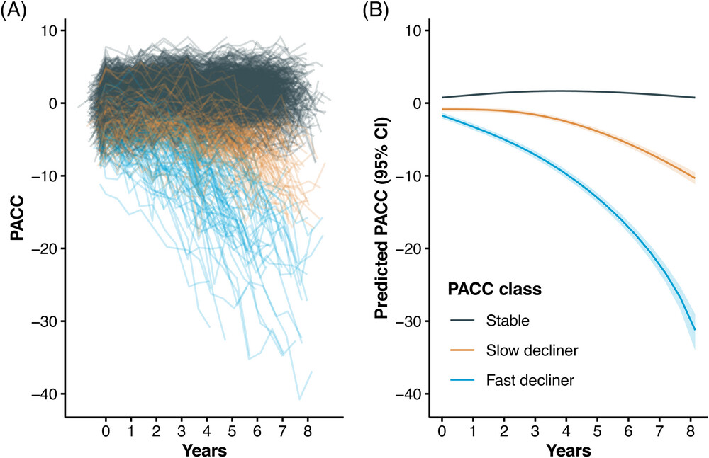

```{r}
#| label: setup
#| include: false

library(A4LEARN)
library(tidyverse)
library(arsenal)
library(kableExtra)
library(nlme)
library(emmeans)
library(splines)
library(clubSandwich)
library(broom)
library(mixtools)
library(patchwork)
# for sva::ComBat batch correction
# if (!requireNamespace("BiocManager", quietly = TRUE))
#     install.packages("BiocManager")
# BiocManager::install("sva")
library(sva)
library(reactable)
library(mmrm)

options(digits = 3)
theme_set(theme_bw())

cbbPalette <- c(
  "#E69F00", "#56B4E9", "#CC79A7",
  "#009E73", "#F0E442", "#999999",
  "#0072B2", "#D55E00", "#000000"
)

grpPalette <- c(LEARN = "#009E73", Placebo = "#0072B2", Solanezumab = "#D55E00")

scale_colour_discrete <- function(...) scale_colour_manual(..., values = cbbPalette)
scale_fill_discrete   <- function(...) scale_fill_manual(..., values = cbbPalette)

formatp <- function(x) case_when(
  x < 0.001 ~ "p<0.001",
  TRUE      ~ format.pval(x, digits = 3, eps = 0.001, nsmall = 3)
)

mean_ci <- function(x) {
  out <- Hmisc::smean.cl.normal(x)
  tibble(
    mean = unname(out[["Mean"]]),
    lower95 = unname(out[["Lower"]]),
    upper95 = unname(out[["Upper"]])
  )
}
```

# Workshop overview

## Goals for today

-   Strategies for **technical artifacts and baseline biomarker modeling**
-   Strategies for **imaging biomarkers**
-   Strategies for **longitudinal cognition**
-   Keep the focus on **interpretation**, **visualization**, and **analysis decisions**

::: notes
This workshop is intentionally narrower than a broad survey course. The goal is to teach a compact toolkit using one coherent study package.
:::

## The 90 minute roadmap

::: incremental
-   **0 to 10 min**: orientation and A4LEARN setup
-   **10 to 30 min**: technical artifacts, baseline biomarker summaries, visualization
-   **30 to 50 min**: imaging biomarker interpretation and standardization using amyloid PET (CL)
-   **50 to 80 min**: longitudinal PACC trajectories and mixed effects models
-   **80 to 90 min**: synthesis and decision framework
:::

## Why A4LEARN? <a href="https://www.a4studydata.org/"></a>

`A4LEARN` is an R study package [@donohue2026alzverse] that bundles

-   data,
-   documentation, and
-   reproducible analysis examples.

from the **Anti-Amyloid Treatment in Asymptomatic Alzheimer’s (A4) trial** and the **Longitudinal Evaluation of Amyloid Risk and Neurodegeneration (LEARN)** study [@A4LEARN].

-   A4 study was a randomized prevention trial in cognitively normal older adults with elevated amyloid [@sperling2023A4]
-   LEARN enrolled amyloid-negative individuals as a companion observational cohort [@sperling2024A4LEARN].
-   Documentation can be found at <https://atri-biostats.github.io/A4LEARN/>
-   The source code to build the R package can be found on [GitHub](https://github.com/atrihub/A4LEARN/tree/main/tools).

## Installation

To obtain and install `A4LEARN`:

-   Register at <https://www.a4studydata.org/> or <https://www.synapse.org/a4_learn_datasharing/>
-   Download `A4LEARN_1.1.20250808.tar.gz` from the preferred data sharing platform
-   In R, run `install.packages("path/to/A4LEARN_1.1.20250808.tar.gz", repos = NULL, type = "source")`

## Organize study data

```{r}
#| echo: true

# Outcomes collected at Visit 1
V1OUTCOME <- A4LEARN::ADQS |>
  filter(VISITCD == "001", SUBSTUDY != "SF") |>
  select(BID, QSTESTCD, QSSTRESN) |>
  tidyr::pivot_wider(values_from = QSSTRESN, names_from = QSTESTCD)

# Outcomes collected at Visit 6
V6OUTCOME <- A4LEARN::ADQS |>
  filter(VISITCD == "006", SUBSTUDY != "SF") |>
  select(BID, QSTESTCD, QSSTRESN) |>
  tidyr::pivot_wider(values_from = QSSTRESN, names_from = QSTESTCD)

V1.6PTAU217 <- A4LEARN::biomarker_pTau217 |>
    filter(TESTCD == "PTAU217", !is.na(ORRESRAW)) |>
    arrange(BID, VISCODE) |>
    filter(!duplicated(BID)) |>
    filter(VISCODE %in% c(1,6)) |>
    select(BID, PTAU217 = ORRESRAW)

SUBJINFO <- A4LEARN::SUBJINFO |>
  filter(SUBSTUDY != "SF") |> 
  left_join(V6OUTCOME, by = "BID") |>
  left_join(V1OUTCOME |> 
    select(BID, CDRSB, CFITOTAL, CFISP, CFIPT, ADLPQPT, ADLPQSP),
    by = "BID") |> 
  left_join(V1.6PTAU217, by = "BID")
```

## Build the longitudinal PACC analysis set

```{r}
#| echo: true

ADQS_PACC <- A4LEARN::ADQS |>
  filter(EPOCH != "SCREENING" | AVISIT == '006') |>
  filter(QSTESTCD == "PACC", !is.na(QSSTRESN)) |>
  rename(PACC = QSSTRESN, PACC_bl = QSBLRES, PACC_ch = QSCHANGE) |>
  select(BID, ASEQNCS, ASEQMMRM, SUBSTUDY, EPOCH, MITTFL, AVISIT, TX, ADURW, AGEYR, 
    AAPOEGNPRSNFLG, EDCCNTU, AMYLCENT, QSVERSION, PACC, PACC_bl, PACC_ch) |>
  mutate(
    Group = case_when(
      SUBSTUDY == "LEARN" ~ "LEARN",
      TRUE ~ TX) |> factor(levels = c("LEARN", "Placebo", "Solanezumab")),
    TX = factor(TX, levels = c("Placebo", "Solanezumab")),
    APOE4 = factor(AAPOEGNPRSNFLG),
    EDUC = EDCCNTU,
    VERSION = factor(QSVERSION),
    Week = case_when(
      as.numeric(AVISIT) < 200 ~ as.numeric(AVISIT)*4 - 24,
      TRUE ~ NA)) |> 
  filter(!is.na(Group)) |>
  left_join(V1.6PTAU217, by = "BID")

BASE_PACC <- ADQS_PACC |>
  arrange(BID, ADURW, ASEQNCS) |>
  group_by(BID) |>
  slice(1) |>
  ungroup()

ALL_BASE_PET <- A4LEARN::SUBJINFO |>
  filter(!is.na(AMYLCENT))
```

The standard RStudio shortcut for the pipe operator ("`|>`" or "`|>`") is:

-   Windows / Linux: `Ctrl + Shift + M`
-   Mac: `Cmd + Shift + M`

# Part 1. Technical artifacts and baseline biomarker modeling

# Technical artifacts

## Why start here?

-   technical nuisance can obscure biological signal
-   visualization should come before modeling
-   the same principle applies to assays, imaging pipelines, and cognition

## Simulated batch effects

```{r}
#| echo: true
set.seed(20200225)

batch_data <- 
  tibble(
    batch = 1:10,
    Sigma = rgamma(n = 10, shape = 360 / 10, scale = 10),
    Mean  = rnorm(n = 10, mean = 850, sd = 200)
  ) |>
  group_by(batch) |>
  nest() |>
  mutate(Biomarker = purrr::map(data, ~rnorm(n = 50, .x$Mean, .x$Sigma))) |>
  unnest(Biomarker) |>
  unnest(data) |>
  ungroup() |>
  arrange(batch) |>
  mutate(
    id = row_number(),
    batch = factor(batch),
    Biomarker = pmax(Biomarker, 0)
  )

ggplot(batch_data, aes(x = batch, y = Biomarker)) +
  geom_boxplot(outlier.shape = NA) +
  geom_dotplot(binaxis = "y", stackdir = "center", dotsize = 0.3, alpha = 0.2)
```

## Testing for batch effects on the mean

```{r}
#| echo: true
anova(lm(Biomarker ~ batch, data = batch_data)) |>
  broom::tidy() |>
  mutate(p.value = formatp(p.value)) |>
  kable(digits = 3)
```

## Testing for batch effects on the variance

```{r}
#| echo: true
# Model 1 (Null): Assumes equal variance across all batches
fit_equal_var <- gls(Biomarker ~ batch, data = batch_data)

# Model 2 (Alternative): Allows different variances for each batch
fit_diff_var <- gls(Biomarker ~ batch, data = batch_data,
  weights = varIdent(form = ~1 | batch))

# Perform the Likelihood Ratio Test
anova(fit_equal_var, fit_diff_var) |>
  as_tibble(rownames = "model") |>
  mutate(`p-value` = formatp(`p-value`)) |>
  select(-call, -Model) |> 
  kable(digits = 3)
```

## Fixing batch effects with ComBat

Adjust for batch effects using the ComBat empirical Bayes framework [@johnson2007adjusting, @sva], which is widely used in genomics and has been applied to imaging and other biomarker data. This method estimates batch-specific location and scale parameters and adjusts the data accordingly, borrowing strength across batches to stabilize estimates.

```{r}
#| echo: true
set.seed(20260603)
batch_data$Biomarker_ComBat <- sva::ComBat(
  dat = rbind(batch_data$Biomarker, jitter(batch_data$Biomarker)),
  batch = batch_data$batch,
  par.prior = TRUE,
  prior.plots = FALSE
)[1,]
```

```{r}
anova(lm(Biomarker_ComBat ~ batch, data = batch_data)) |>
  broom::tidy() |>
  mutate(p.value = formatp(p.value)) |>
  kable(digits = 3)

# Model 1 (Null): Assumes equal variance across all batches
fit_combat_equal_var <- gls(Biomarker_ComBat ~ batch, data = batch_data)

# Model 2 (Alternative): Allows different variances for each batch
fit_combat_diff_var <- gls(Biomarker_ComBat ~ batch, data = batch_data,
  weights = varIdent(form = ~1 | batch))

# Perform the Likelihood Ratio Test
anova(fit_combat_equal_var, fit_combat_diff_var) |>
  as_tibble(rownames = "model") |>
  mutate(`p-value` = formatp(`p-value`)) |>
  select(-call, -Model) |> 
  kable(digits = 3)

ggplot(batch_data, aes(x = batch, y = Biomarker_ComBat)) +
  geom_boxplot(outlier.shape = NA) +
  geom_dotplot(binaxis = "y", stackdir = "center", dotsize = 0.3, alpha = 0.2)
```

See also `longComBat` for longitudinal data [@longComBat].

## Practical take-home on batch effects

::: incremental
-   visualize by plate or batch before modeling
-   randomize samples when possible
-   adjust for known technical nuisance in the model
-   do not let biology become confounded with assay logistics
:::

# Baseline characteristics

## Baseline subject characteristics

```{r}
#| results: asis

A4labels <- c(
  AGEYR = "Age (years)",
  APOE4 = "APOEε4 carrier",
  EDUC = "Education (years)",
  PTAU217 = "Baseline pTau217 (U/ml)",
  AMYLCENT = "Baseline amyloid PET (CL)",
  PACC = "Baseline PACC"
)

BASE_TAB <- arsenal::tableby(
  Group ~ AGEYR + APOE4 + EDUC + PTAU217 + AMYLCENT + PACC,
  data = BASE_PACC
)

summary(BASE_TAB, labelTranslations = A4labels, text = TRUE)
```

## Baseline PACC distribution by treatment

```{r}
ggplot(BASE_PACC, aes(x = Group, y = PACC, fill = Group)) +
  geom_boxplot(alpha = 0.6, outlier.shape = NA) +
  ggbeeswarm::geom_beeswarm(width = 0.15, alpha = 0.2, size = 1) +
  labs(x = "", y = "Baseline PACC") +
  theme(legend.position = "none") +
  scale_fill_manual(values = grpPalette)
```

## Baseline biomarker versus baseline cognition

```{r}
ggplot(BASE_PACC, aes(x = AMYLCENT, y = PACC, color = Group)) +
  geom_point(alpha = 0.5) +
  geom_smooth(method = "lm", se = TRUE) +
  labs(
    x = "Baseline amyloid PET biomarker (CL)",
    y = "Baseline PACC") +
  scale_colour_manual(values = grpPalette)
```

## A simple baseline regression

```{r}
fit_bl <- lm(PACC ~ scale(AMYLCENT) + scale(PTAU217) + scale(AGEYR) + APOE4 + 
  scale(EDUC), data = BASE_PACC)

broom::tidy(fit_bl) |>
  mutate(p.value = formatp(p.value)) |>
  kable(digits = 3)
```

# Part 2. Imaging biomarker interpretation

# Imaging biomarkers

## The analysis question

> How do we interpret and standardize a baseline imaging biomarker in a way that supports downstream modeling?

## Distribution of baseline amyloid PET (CL)

```{r}
ggplot(ALL_BASE_PET, aes(x = AMYLCENT)) +
  geom_histogram(aes(y = after_stat(density)), bins = 30, fill = "grey75", color = "white") +
  geom_density(color = cbbPalette[1], linewidth = 1.2) +
  geom_vline(xintercept = 0, color = "red", linetype = "dashed", size = 1) +
  geom_vline(xintercept = 100, color = "red", linetype = "dashed", size = 1) +
  labs(x = "All screening amyloid PET (CL)", y = "Density")
```

## ECDF standardization

```{r}
#| echo: true
ecdf_suvr <- ecdf(ALL_BASE_PET$AMYLCENT)

ALL_BASE_PET <- ALL_BASE_PET |>
  mutate(
    AMYLCENT_pct = ecdf_suvr(AMYLCENT),
    AMYLCENT_z = qnorm(pmin(pmax(AMYLCENT_pct, 1e-6), 1 - 1e-6)))
```

## Percentiles and z-scores

```{r}
#| echo: false
p1 <- ggplot(ALL_BASE_PET, aes(x = AMYLCENT)) +
  geom_histogram(aes(y = after_stat(density)), bins = 30, fill = "grey75", color = "white") +
  geom_density(color = cbbPalette[1], linewidth = 1.2) +
  geom_vline(xintercept = 0, color = "red", linetype = "dashed", size = 1) +
  geom_vline(xintercept = 100, color = "red", linetype = "dashed", size = 1) +
  labs(x = "Amyloid PET (CL)", y = "Density")

p2 <- ggplot(ALL_BASE_PET |> arrange(AMYLCENT), aes(x = AMYLCENT, y = AMYLCENT_pct*100)) +
  geom_line(color = cbbPalette[2], size = 2) +
  geom_vline(xintercept = 0, color = "red", linetype = "dashed", size = 1) +
  geom_vline(xintercept = 100, color = "red", linetype = "dashed", size = 1) +
  labs(x = "Amyloid PET (CL)", y = "Percentile (%)")

p3 <- ggplot(ALL_BASE_PET |> arrange(AMYLCENT), aes(x = AMYLCENT, y = AMYLCENT_z)) +
  geom_line(color = cbbPalette[2], size = 2) +
  geom_vline(xintercept = 0, color = "red", linetype = "dashed", size = 1) +
  geom_vline(xintercept = 100, color = "red", linetype = "dashed", size = 1) +
  labs(x = "Amyloid PET (CL)", y = "Z-score")

p1 + p2 + p3
```

## Percentiles and z-scores

```{r}
#| echo: false

p1 <- ggplot(ALL_BASE_PET, aes(x = AMYLCENT_z)) +
  geom_histogram(aes(y = after_stat(density)), bins = 30, fill = "grey75", color = "white") +
  geom_density(color = cbbPalette[1], linewidth = 1.2) +
  labs(x = "ECDF-derived z-score for amyloid PET", y = "Density")

p2 <- ggplot(ALL_BASE_PET, aes(x = scale(AMYLCENT))) +
  geom_histogram(aes(y = after_stat(density)), bins = 30, fill = "grey75", color = "white") +
  geom_density(color = cbbPalette[1], linewidth = 1.2) +
  labs(x = "Usual z-score for amyloid PET", y = "Density")

p1 + p2
```

## Why bother with ECDF standardization?

::: incremental
-   no parametric assumptions
-   percentiles are intuitive
-   easy bridge from biomarker scale to standardized scale
-   useful for harmonization and modeling
-   see also weighted ECDFs for covariate adjustment: [`Hmisc::wtd.Ecdf`](https://search.r-project.org/CRAN/refmans/Hmisc/html/wtd.stats.html)
:::

## Finding unsupervised latent-threshold with a mixture model

```{r}
#| eval: true
mix_centiloid <- mixtools::normalmixEM(ALL_BASE_PET$AMYLCENT, k = 2)

plot_mix_comp <- function(x, mu, sigma, lam) {
  lam * dnorm(x, mu, sigma)
}

mix_post <- mix_centiloid$posterior |>
  as_tibble() |>
  mutate(
    AMYLCENT = mix_centiloid$x,
    p1 = plot_mix_comp(AMYLCENT, 
      mu = mix_centiloid$mu[1], 
      sigma = mix_centiloid$sigma[1], 
      lam = mix_centiloid$lambda[1]),
    p2 = plot_mix_comp(AMYLCENT, 
      mu = mix_centiloid$mu[2], 
      sigma = mix_centiloid$sigma[2], 
      lam = mix_centiloid$lambda[2])) |>
  arrange(AMYLCENT)

mix_threshold <- with(mix_post |> filter(AMYLCENT>0, AMYLCENT<50), 
  approx(x = p1-p2, y = AMYLCENT, xout = 0))$y

ggplot(mix_post, aes(x=AMYLCENT)) +
  geom_histogram(aes(y = after_stat(density)), bins = 35, fill = "grey80") +
  geom_line(aes(y = p1), color = cbbPalette[2], linewidth = 1.2) +
  geom_line(aes(y = p2), color = cbbPalette[1], linewidth = 1.2) +
  geom_vline(xintercept = mix_threshold, color = "red", linetype = "dashed", size = 1) +
  annotate(
    "text",
    x = mix_threshold + 5, y = max(mix_post$p1) * 0.8,
    label = paste0("Mixture model threshold: ", round(mix_threshold, 1), " CL"),
    color = "red", size = 4, hjust = 0) +
  labs(x = "Amyloid PET (CL)", y = "Density")
```

# Part 3. Longitudinal cognition

# Longitudinal PACC

## Start with the plot

```{r}
ggplot(ADQS_PACC, aes(x = ADURW, y = PACC, color = Group)) +
  geom_line(aes(group = BID), alpha = 0.12) +
  geom_smooth(method = "loess", se = TRUE, linewidth = 1.2) +
  labs(
    x = "Weeks from baseline",
    y = "PACC") +
  scale_color_manual(values = grpPalette)
```

## Longitudinal summaries by treatment and time

```{r}
PACC_SUM <- ADQS_PACC |>
  filter(!is.na(Week), Week %in% seq(0, 456, 24)) |>
  group_by(Group, Week) |>
  summarise(
    n = n(),
    sd = sd(PACC),
    mean_ci(PACC),
    .groups = "drop")

PACC_SUM |>
  filter(Week %in% seq(0, 240, 48)) |>
  arrange(Week, Group) |>
  mutate(across(c(sd, mean, lower95, upper95), ~ round(., 2))) |>
  reactable()
```

## Mean profiles with 95% confidence intervals

```{r}
p1 <- ggplot(PACC_SUM, aes(x = Week, y = mean, color = Group, group = Group)) +
  geom_line(linewidth = 1) +
  geom_point(size = 1.5) +
  geom_errorbar(aes(ymin = lower95, ymax = upper95), width = 0) +
  labs(
    x = "Weeks from baseline",
    y = "Mean PACC (95% CI)") +
  scale_color_manual(values = grpPalette)

t1 <- ggplot(PACC_SUM, aes(x = Week, y = Group, label = n, color = Group)) +
  geom_text(size = 3.5, show.legend = FALSE) +
  labs(x = "", y = "") +
  scale_color_manual(values = grpPalette) +
  theme_classic() +
  theme(
    # Strip away all the typical plot elements to make it look like a table
    panel.grid = element_blank(),
    panel.border = element_blank(),
    axis.line = element_blank(),
    axis.ticks = element_blank(),
    axis.text.x = element_blank()) # Hide x-axis text (we rely on the main plot for week numbers)

p1 / t1 + 
  plot_layout(heights = c(4, 1))
```

## Why ordinary regression is not enough

-   repeated measures within participant are correlated, cannot treat them as independent observations
-   complete-case endpoint analyses discard information
-   mixed effects models estimate both population-level and subject-level trajectories

## Mixed effects model for PACC

```{r}
fit_lme <- nlme::lme(
  PACC ~ ns(ADURW, df = 2) * Group + AGEYR + APOE4 + EDUC + AMYLCENT,
  random = ~ ADURW | BID,
  data = ADQS_PACC,
  na.action = na.exclude,
  control = nlme::lmeControl(opt = "optim"))
```

## Fixed effects summary

```{r}
coef_tab <- summary(fit_lme)$tTable |>
  as.data.frame() |>
  rownames_to_column("term") |>
  mutate(p.value = formatp(`p-value`)) |>
  select(term, Value, Std.Error, DF, `t-value`, p.value)

kable(coef_tab, digits = 3)
```

## Interpretation of the model

::: incremental
-   fixed effects estimate average relationships in the population
-   random intercepts allow different starting levels by participant
-   random slopes allow different rates of change by participant
-   the `ns(ADURW, df = 2)` terms allows for flexible nonlinear change over time
-   the `ns(ADURW, df = 2) × TX` interaction estimates differential longitudinal change by treatment
:::

## Model-based mean profiles

```{r}
visits <- seq(0, 456, 24)

pacc_emms <- ref_grid(fit_lme, 
  at = list(ADURW = visits),
  cov.reduce = AMYLCENT ~ Group) |>
  emmeans(specs = ~ Group | ADURW) |>
  as.data.frame()
```

```{r}
p1 <- ggplot(pacc_emms, aes(x = ADURW, y = emmean, group = Group)) +
  geom_line(aes(color = Group), linewidth = 1.1) +
  geom_point(aes(color = Group), size = 1.8) +
  geom_ribbon(aes(fill = Group, ymin = lower.CL, ymax = upper.CL), alpha = 0.2) +
  labs(
    x = "Weeks from baseline",
    y = "Model-based mean PACC (95% CI)") +
  scale_color_manual(values = grpPalette) +
  scale_fill_manual(values = grpPalette) + 
  theme(legend.position = "none")

p2 <- ggplot(pacc_emms, aes(x = ADURW, y = emmean, group = Group)) +
  geom_line(data = ADQS_PACC, aes(group = BID, y = PACC,
    color = Group), alpha = 0.05) +
  geom_line(aes(color = Group), linewidth = 1.1) +
  geom_point(aes(color = Group), size = 1.8) +
  geom_ribbon(aes(fill = Group, ymin = lower.CL, ymax = upper.CL), alpha = 0.2) +
  labs(
    x = "Weeks from baseline",
    y = "Model-based mean PACC (95% CI)") +
  scale_color_manual(values = grpPalette) +
  scale_fill_manual(values = grpPalette) +
  guides(color = guide_legend(override.aes = list(alpha = 1)))

p1 + p2 + plot_layout(guides = "collect")
```

## Latent classes of longitudinal trajectories

Note that downward trend in A4 is driven by a minority of participants with more rapid decline. We have used latent class mixed models to identify subgroups of participants with different longitudinal trajectories [@li2026divergent]. Code [here](https://github.com/atri-biostats/A4LEARN/blob/HEAD/vignettes/articles/A4LEARN-Latent-Classes.qmd).

<a href="https://doi.org/10.1002/alz.71366"></a>

## Do cognitive test version effects matter?

::::: columns
::: {.column width="50%"}
-   version effects are a real example of longitudinal nuisance variation
-   this is analogous to platform, scanner, or assay-version effects in other settings
-   model comparison can help decide whether the nuisance term materially improves fit
:::

::: {.column width="50%"}
```{r}
fit_lme_ver <- update(fit_lme, . ~ . + VERSION)

data.frame(
  Model = c("Without version effect", "With version effect"),
  AIC = c(AIC(fit_lme), AIC(fit_lme_ver)),
  BIC = c(BIC(fit_lme), BIC(fit_lme_ver))) |>
  arrange(AIC) |>
  kable(digits = 2)
```
:::
:::::

## MMRM versus cLDA, conceptually

Both approaches are used for analysis of **randomized trials with repeated measures**, but they differ in how they handle baseline and time:

### Mixed Model Repeated Measures (MMRM)

-   change from baseline as outcome
-   baseline as covariate
-   time as categorical factor
-   residuals usually assumed correlated within participant, but no subject-specific random effects
-   very common in randomized trials

### Constrained Longitudinal Data Analysis (cLDA)

-   raw scores modeled directly, including baseline
-   common baseline mean constraint in randomized groups
-   time can be modeled as continuous (e.g. with splines) or categorical (see @donohue2023natural)
-   often attractive when baseline missingness matters

## Missing data in 2 minutes

-   Missing Completely at Random (MCAR) is usually unrealistic
-   mixed model likelihood methods using all available observations are generally justified under Missing at Random (MAR): missingness that depends on observed data but not unobserved data
-   Missing Not at Random (MNAR) --- missingness that depends on *unobserved* data --- cannot be ruled out from observed data by definition, but sensitivity analyses can be used to explore the impact of different MNAR assumptions on conclusions

# Synthesis

## A simple decision framework

-   **Technical artifact problem**\
    Visualize first, adjust nuisance in the model

-   **Baseline biomarker and cognition question**\
    Use regression, preserve continuous scales

-   **Need for comparability or harmonization**\
    Standardize first, then model

-   **Repeated measures outcome**\
    Need longitudinal models that account for within-subject correlation

## If you remember only four things

::: incremental
-   visualize before modeling
-   adjust technical nuisance before biological interpretation
-   standardization choices affect interpretation
-   repeated measures require repeated-measures methods
:::

# Backup topics, if time allows

# Spline cLDA with `nlme::gls` with Toeplitz correlation and variance by subject

```{r}
ADQS_PACC_A4 <- ADQS_PACC |>
  filter(SUBSTUDY == "A4", !is.na(ASEQNCS), MITTFL == 1,
    EPOCH == "BLINDED TREATMENT" | AVISIT == "006") |>
  mutate(ASEQNCS_f = as.factor(ASEQNCS))

a4_spline_gls <- gls(
    PACC ~ ns(ADURW, df = 2) : TX + 
    AGEYR + APOE4 + EDUC + AMYLCENT + QSVERSION,
  data = ADQS_PACC_A4,
  weights = varIdent(form = ~ 1 | ASEQNCS),
  correlation = corARMA(form = ~ ASEQNCS | BID, p = 10))

ref_grid(a4_spline_gls,
  at = list(ADURW = c(0,240), TX = levels(ADQS_PACC_A4$TX)),
  vcov. = clubSandwich::vcovCR(a4_spline_gls, type = "CR2") |> as.matrix(), 
  data = ADQS_PACC_A4, 
  mode = "satterthwaite") |>
  emmeans(~ ADURW | TX) |>
  pairs(reverse = TRUE) |>
  as_tibble() |>
  select(-contrast) |>
  mutate(p.value = formatp(p.value)) |>
  kable(caption = "Mean PACC change from baseline at week 240 by treatment 
    group estimated from spline model.", digits = 2, booktabs = TRUE)

ref_grid(a4_spline_gls, 
  at = list(ADURW = 240, TX = levels(ADQS_PACC_A4$TX)),
  vcov. = clubSandwich::vcovCR(a4_spline_gls, type = "CR2") |> as.matrix(), 
  data = ADQS_PACC_A4, 
  mode = "satterthwaite") |>
  emmeans(specs = "TX", by = "ADURW") |>
  pairs(reverse = TRUE, adjust = "none") |>
  summary(infer = c(TRUE, TRUE)) |> 
  as_tibble() |>
  mutate(p.value = formatp(p.value)) |>
  kable(caption = "Mean PACC group change from baseline at week 240 by treatment 
    group estimated from spline model.", digits = 2)
```

# cLDA using `mmrm::mmrm` with unstructured correlation and variance by subject

```{r}
a4_spline_mmrm <- mmrm(
  PACC ~ ns(ADURW, df = 2) : TX + 
    AGEYR + APOE4 + EDUC + AMYLCENT + QSVERSION + us(ASEQNCS_f | BID),
  data = ADQS_PACC_A4,
  method = "Kenward-Roger")

ref_grid(a4_spline_mmrm,
  at = list(ADURW = c(0,240), TX = levels(ADQS_PACC_A4$TX))) |>
  emmeans(~ ADURW | TX) |>
  pairs(reverse = TRUE) |>
  as_tibble() |>
  mutate(p.value = formatp(p.value)) |>
  select(-contrast) |>
  kable(caption = "Mean PACC change from baseline at week 240 by treatment 
    group estimated from spline model.", digits = 2)

ref_grid(a4_spline_mmrm, 
  at = list(ADURW = 240, TX = levels(ADQS_PACC_A4$TX))) |>
  emmeans(specs = "TX", by = "ADURW") |>
  pairs(reverse = TRUE, adjust = "none") |> 
  summary(infer = c(TRUE, TRUE)) |> 
  as_tibble() |>
  mutate(p.value = formatp(p.value)) |>
  kable(caption = "Mean group difference in PACC change from baseline at week 240 estimated from spline model.", digits = 2)
```

# MMRM with `mmrm::mmrm` with categorical time and unstructured correlation

```{r}
ADQS_PACC_A4_MMRM <- ADQS_PACC |>
  filter(SUBSTUDY == "A4", !is.na(ASEQMMRM), MITTFL == 1,
    EPOCH == "BLINDED TREATMENT" | AVISIT == "006") |>
  mutate(
    ASEQMMRM_f = as.factor(ASEQMMRM),
    AVISIT = as.factor(AVISIT))

a4_cat_mmrm <- mmrm(
  PACC_ch ~ AVISIT * (TX + PACC_bl) +
    AGEYR + APOE4 + EDUC + AMYLCENT + QSVERSION + us(AVISIT | BID),
  data = ADQS_PACC_A4_MMRM,
  method = "Kenward-Roger")

ref_grid(a4_cat_mmrm,
  at = list(AVISIT = '066', TX = levels(ADQS_PACC_A4_MMRM$TX))) |>
  emmeans(~ AVISIT | TX) |>
  summary(infer = c(TRUE, TRUE)) |> 
  as_tibble() |>
  mutate(p.value = formatp(p.value)) |>
  select(-AVISIT) |>
  kable(caption = "Mean PACC change from baseline at visit 66 by treatment 
    group estimated from categorical time MMRM.", digits = 2)

ref_grid(a4_cat_mmrm, 
  at = list(AVISIT = '066', TX = levels(ADQS_PACC_A4_MMRM$TX))) |>
  emmeans(specs = "TX", by = "AVISIT") |>
  pairs(reverse = TRUE, adjust = "none") |> 
  summary(infer = c(TRUE, TRUE)) |> 
  as_tibble() |>
  mutate(p.value = formatp(p.value)) |>
  select(-AVISIT) |>
  kable(caption = "Mean group difference in PACC change from baseline at visit 66 estimated from categorical time MMRM.", digits = 2)
```

# Missing data sensitivity analyses

To do

# References

::: {#refs}
:::

## Session information

```{r}
sessionInfo()
```
